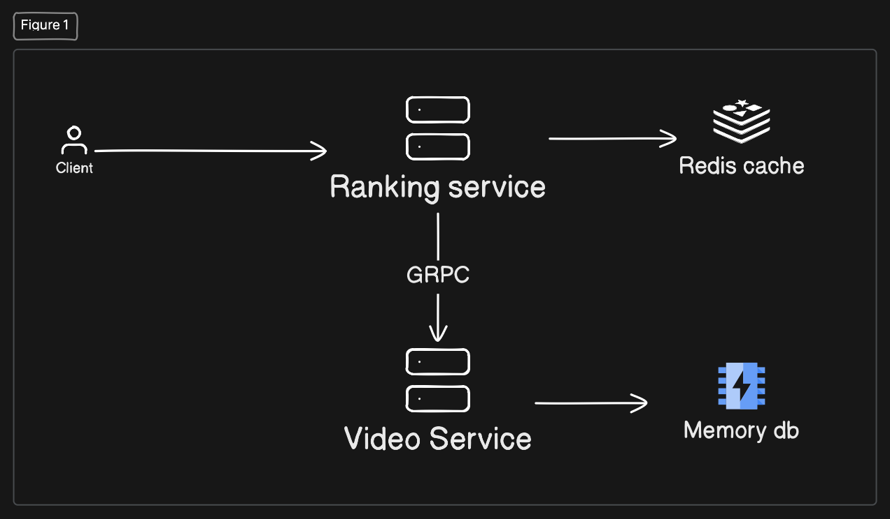

# Trinity

Project using 
- Hexagonal architecture
- Gin Router
- Redis
- GRPC

## High level system design

This's system design for this project but it not practice
It only handle high low-latency and high ccu

``` bash
ab -n 10000 -c 50 http://localhost:5002/v1/videos/ranked
```
In my device (M4Pro, 48GB ram):
- Max response time ~ 11ms
- Requests per second:    10716.34 [#/sec] (mean)

I'm using POST here because i want use ab test. It only support GET and POST method. Recommend use PATCH or PUT here
``` bash
ab -n 100000 -c 50 -p <(echo '{"action": "like", "value": 1}') -T "application/json" http://localhost:5002/v1/videos/1/score
```

In my device (M4Pro, 48GB ram):
- Max response time ~ 50ms
- Requests per second:    8292.98 [#/sec] (mean)

<!-- 
## High level system design (If I have more time I will do it)

I think, this system design will be handle for scalable 
 -->

## How to run this project

 ```bash
 make run
 ```
 Or
 ```bash
 docker compose --profile default up --build -d
 ```

## How to run test
Only test business core logic
Mock test with `user-go/mock`
```
go clean -testcache && go test internal/ranking/core/services/*_test.go -v
```

## Swagger url
```
http://localhost:5002/swagger/index.html
```